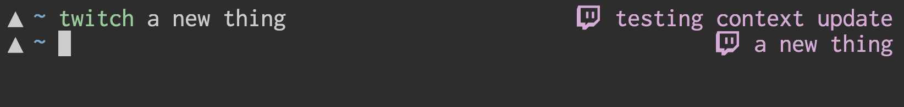

# geometry_twitch

something to provide context while streaming. its really just prepend-only log. check out [twitch.tv/microNS](https://twitch.tv/microNS)

Source [geometry_twitch.zsh](/geometry_twitch.zsh), then add geometry_twitch to your prompt (`GEOMETRY_RPROMPT+=(geometry_twitch)`).

Change the color with `GEOMETRY_TWITCH_COLOR`, the symbol with `GEOMETRY_TWITCH_SYMBOL`, and the file location with `GEOMETRY_TWITCH`.
